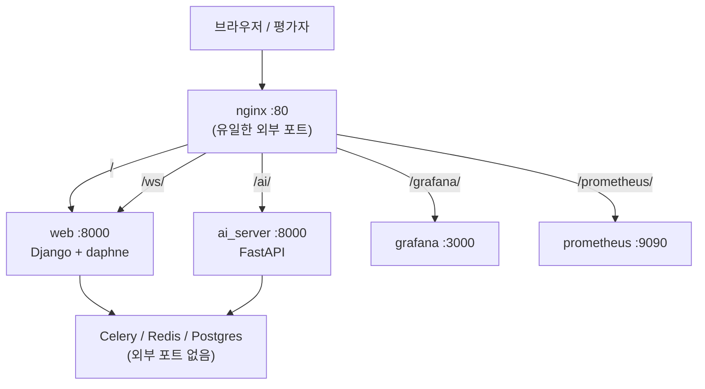

# nginx 리버스 프록시 (단일 포트 80)

Phase 4 EC2 시연에서 **외부에 노출하는 포트를 80 하나**로 줄이기 위한 구성입니다.  
시연 절차는 [DEMO_EC2.md](./DEMO_EC2.md), 일정은 [phases/WBS_SCHEDULE_0602_0608.md](./phases/WBS_SCHEDULE_0602_0608.md)를 참고하세요.

---

## 1. 왜 프록시를 쓰나

Docker Compose 기본 구성은 서비스마다 호스트 포트를 따로 엽니다.

| 서비스 | 컨테이너 포트 | (이전) 호스트 포트 |
|--------|---------------|-------------------|
| Django `web` | 8000 | 8000 |
| FastAPI `ai_server` | 8000 | 8001 |
| Grafana | 3000 | 3000 |
| Prometheus | 9090 | 9090 |

EC2 **보안 그룹**에 8000·8001·3000·9090을 모두 열면 관리·노출 면적이 커집니다.  
**nginx**가 80번만 받아 경로(`/`, `/ai/`, …)로 내부 서비스에 넘기면 **인바운드는 80(+ SSH 22)** 만 열어도 시연이 가능합니다.

### 앱 코드는 바꾸지 않음

- 브라우저 → Django: `http://<호스트>/`
- Celery·Django → FastAPI: Docker 내부 `http://ai_server:8000` (`FASTAPI_URL`) — **변경 없음**
- WebSocket: `ws://<호스트>/ws/tasks/?token=...` — nginx가 `web`으로 프록시

---

## 2. 아키텍처



---

## 3. URL 매핑

### 외부 (브라우저·발표)

| 경로 | 내부 upstream | 용도 |
|------|---------------|------|
| `/` | `web:8000` | 메인 UI, `/api/*`, Admin |
| `/ws/` | `web:8000` | WebSocket 태스크 알림 |
| `/ai/` | `ai_server:8000` | FastAPI (`/ai/docs`, `/ai/health`, `/ai/transform` …) |
| `/grafana/` | `grafana:3000` | 모니터링 대시보드 |
| `/prometheus/` | `prometheus:9090` | 메트릭 UI |

**예시 (EC2 IP가 `13.211.8.186`일 때)**

| 이전 (포트 분리) | 현재 (프록시) |
|------------------|---------------|
| `http://13.211.8.186:8000/` | `http://13.211.8.186/` |
| `http://13.211.8.186:8001/docs` | `http://13.211.8.186/ai/docs` |
| `http://13.211.8.186:3000/` | `http://13.211.8.186/grafana/` |
| `http://13.211.8.186:9090/` | `http://13.211.8.186/prometheus/` |

### EC2 서버 내부 헬스 체크 (SSH 후)

```bash
curl -fsS http://127.0.0.1/
curl -fsS http://127.0.0.1/ai/health
curl -fsS http://127.0.0.1/static/css/main.css
curl -fsS http://127.0.0.1/grafana/api/health
curl -fsS http://127.0.0.1/prometheus/prometheus/-/healthy
```

CD 워크플로(`.github/workflows/cd.yml`)도 위 **80번 경로**로 smoke check 합니다.

---

## 4. 관련 파일

| 파일 | 역할 |
|------|------|
| [nginx/nginx.conf](../nginx/nginx.conf) | 경로별 `proxy_pass`, WebSocket Upgrade, Docker DNS |
| [docker-compose.yml](../docker-compose.yml) | `nginx` 서비스 `80:80`; `web`·`ai_server`·`grafana`·`prometheus`는 `expose`만 |
| [.env.example](../.env.example) | `ALLOWED_HOSTS`, `PUBLIC_BASE_URL` |
| [.github/workflows/cd.yml](../.github/workflows/cd.yml) | 배포 후 `http://127.0.0.1/`, `/ai/health` 검증 |

### nginx 설정 요약

- **`resolver 127.0.0.11`**: Docker 내장 DNS. upstream 이름을 변수(`$upstream_web` 등)로 두어 **컨테이너 기동 순서** 이슈 완화.
- **`/ai/`**, **`/grafana/`**, **`/prometheus/`**: 정규식 location으로 prefix 제거 후 upstream에 전달.  
  예: `/ai/health` → `ai_server:8000/health`
- **`/ws/`**: `Upgrade` / `Connection` 헤더로 WebSocket 유지.

### Grafana / Prometheus 서브경로

프록시 뒤에서 링크·리다이렉트가 깨지지 않도록 환경 변수가 필요합니다.

```yaml
# docker-compose.yml 발췌
GF_SERVER_ROOT_URL: ${PUBLIC_BASE_URL:-http://localhost}/grafana/
GF_SERVER_SERVE_FROM_SUB_PATH: "true"

# prometheus command
--web.external-url=${PUBLIC_BASE_URL:-http://localhost}/prometheus/
--web.route-prefix=/prometheus/
```

`.env`의 `PUBLIC_BASE_URL`은 **프로토콜+호스트, 끝 슬래시 없음**:

```bash
# EC2
PUBLIC_BASE_URL=http://13.211.8.186

# 로컬 Docker
PUBLIC_BASE_URL=http://localhost
```

### ALLOWED_HOSTS

`web` 서비스는 compose에서 `.env` 값을 사용합니다.

```yaml
ALLOWED_HOSTS: ${ALLOWED_HOSTS:-localhost,127.0.0.1,web,0.0.0.0}
```

EC2 `.env` 예:

```bash
ALLOWED_HOSTS=localhost,127.0.0.1,web,13.211.8.186
```

브라우저가 80번으로 접속할 때 `Host` 헤더는 IP(또는 도메인)만 오므로, **공인 IP/도메인이 목록에 있어야** 합니다.

---

## 5. 배포 절차

### 최초 / 갱신

```bash
cd ~/Promptory   # EC2_APP_DIR
git pull origin main
# .env: SECRET_KEY, ALLOWED_HOSTS, PUBLIC_BASE_URL, LLM_PROVIDER=mock
docker compose up -d --build
docker compose exec web python manage.py migrate --noinput
```

### AWS 보안 그룹

| Type | Port | Source | 비고 |
|------|------|--------|------|
| SSH | 22 | 내 IP | 관리 |
| HTTP | **80** | `0.0.0.0/0` 또는 내 IP | **시연 필수** |

8000·8001·3000·9090은 **열지 않아도** 됩니다.

### 예전 3차: 호스트 nginx + gunicorn

일부 EC2에는 **호스트 OS nginx**가 80번을 쓰며 `gunicorn.sock`으로 프록시하는 설정이 남아 있을 수 있습니다 (`/etc/nginx/sites-enabled/promptory`).  
Docker nginx와 **포트 충돌**합니다.

```bash
sudo systemctl stop nginx
sudo systemctl disable nginx
docker compose up -d --build
```

확인:

```bash
sudo ss -tlnp | grep ':80'
docker compose ps nginx   # 0.0.0.0:80->80/tcp, healthy
```

---

## 6. 로컬 개발 (Docker Compose)

이전처럼 `http://localhost:8000`이 아니라 **`http://localhost/`** 로 접속합니다.

```bash
cp .env.example .env
# PUBLIC_BASE_URL=http://localhost
# ALLOWED_HOSTS=localhost,127.0.0.1,web
docker compose up -d --build
```

| URL | 확인 |
|-----|------|
| http://localhost/ | 홈 |
| http://localhost/ai/docs | FastAPI Swagger |
| http://localhost/grafana/ | Grafana |

---

## 7. 트러블슈팅

| 증상 | 원인 | 조치 |
|------|------|------|
| `ERR_CONNECTION_TIMED_OUT` (외부) | SG에 80 미개방 | 인바운드 TCP 80 추가 |
| `address already in use` (:80) | 호스트 nginx 점유 | `systemctl stop nginx` 후 compose 재기동 |
| nginx `host not found in upstream "web"` | 기동 순서 / DNS | `nginx/nginx.conf`의 `resolver`+변수 upstream 유지; `depends_on` healthy 대기 |
| `400 DisallowedHost` | `ALLOWED_HOSTS`에 IP 없음 | `.env` + compose `${ALLOWED_HOSTS}` 확인 후 `web` 재생성 |
| `/ai/health` 404 | prefix 전달 오류 | `location ~ ^/ai/?(.*)$` 블록 확인 |
| Grafana 빈 화면·CSS 깨짐 | `GF_SERVER_ROOT_URL` 불일치 | `PUBLIC_BASE_URL`을 실제 접속 URL과 맞춤 |
| WebSocket 실패 | Upgrade 미전달 | `/ws/` location에 `proxy_http_version 1.1` + Upgrade 헤더 |

로그:

```bash
docker compose logs nginx --tail 50
docker compose logs web --tail 50
```

---

## 8. 난이도·범위 참고

| 작업 | 난이도 |
|------|--------|
| nginx + Django만 `/` | 쉬움 |
| `/ai/` FastAPI prefix | 보통 |
| Grafana·Prometheus 서브경로 | 보통 |
| WebSocket `/ws/` | 보통 |
| EC2 기존 gunicorn/nginx 정리 | 환경 의존 |

HTTPS(443)·도메인·Let’s Encrypt는 이번 MVP 범위 밖입니다. 필요 시 `PUBLIC_BASE_URL`을 `https://...`로 바꾸고 인증서 termination을 nginx에 추가하면 됩니다.

---

## 9. 문서 이력

| 날짜 | 내용 |
|------|------|
| 2026-06-08 | 최초 작성 — Docker nginx 단일 포트 80, EC2 전환·트러블슈팅 정리 |
