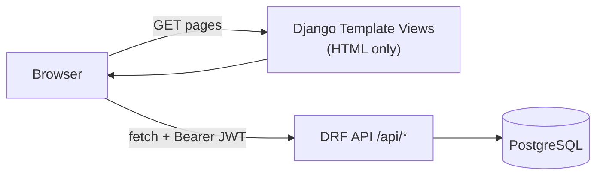
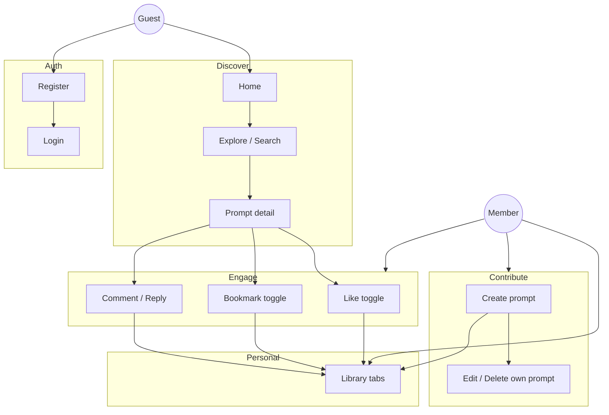
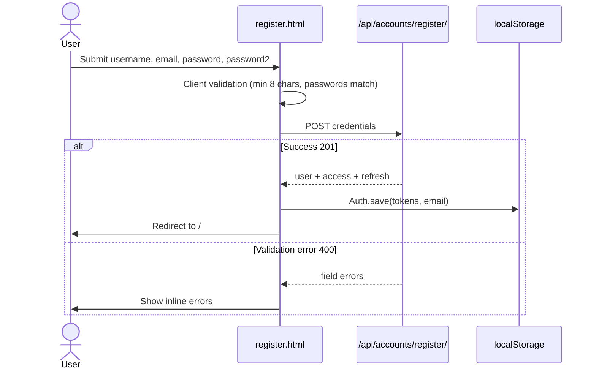
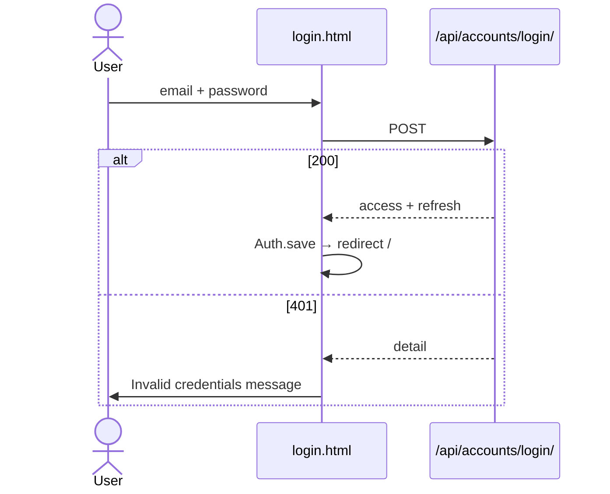
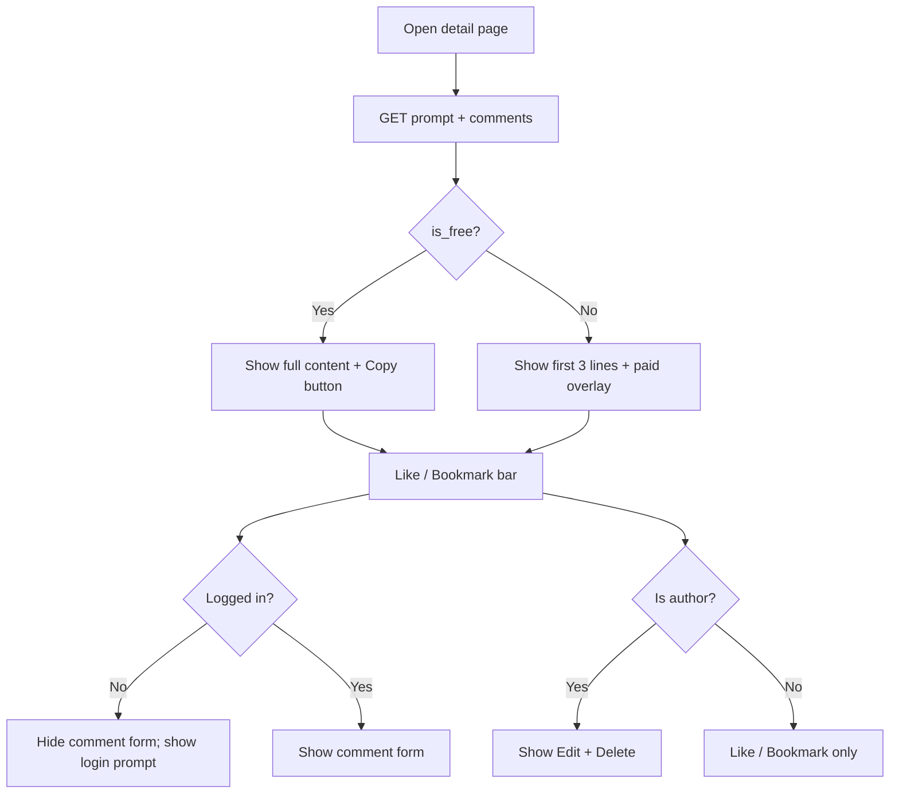
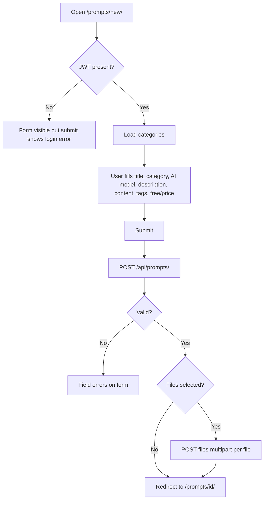
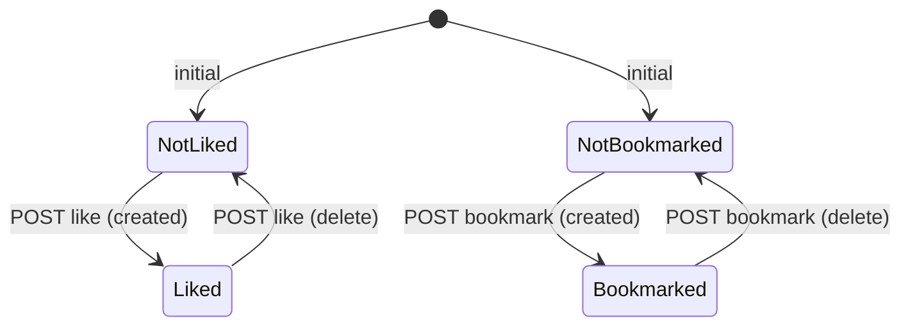
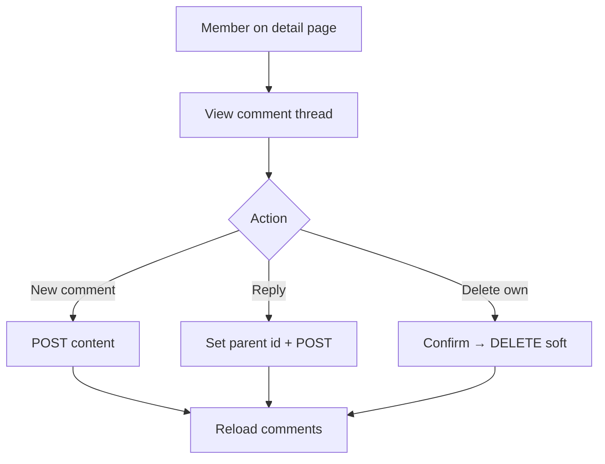
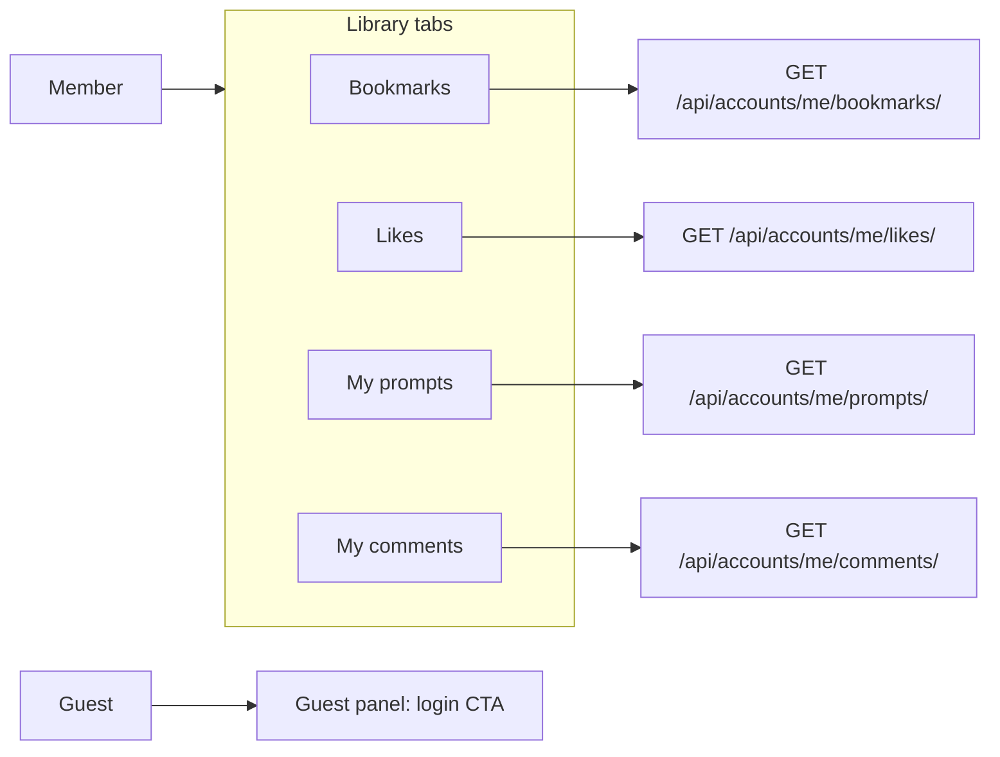

# Promptory — User Flow Design

**Product:** AI prompt sharing and marketplace  
**Stack:** Django 4.2 (templates) + DRF (API) + JWT (browser `localStorage`)  
**Last updated:** 2026-05-27

This document describes end-to-end user journeys as implemented in the codebase. UI routes render HTML shells; all data and permissions are enforced through the REST API under `/api/`.

---

## 1. Product goals

| Goal | How the product supports it |
|------|-----------------------------|
| Discover prompts | Home, Explore (`/prompts/`), search, filters, sorting |
| Share prompts | Create form, tags, categories, optional attachments |
| Engage | Likes, bookmarks, threaded comments |
| Personal library | Bookmarks, likes, own prompts, own comments |
| Monetization (partial) | Free vs paid flag; paid prompts show preview only (no checkout yet) |

---

## 2. Actors

| Actor | Description | Typical entry |
|-------|-------------|---------------|
| **Guest** | Not logged in; can browse public content | `/`, `/prompts/` |
| **Member** | Registered user with JWT in `localStorage` | After register/login |
| **Author** | Member who owns a prompt (`user_id` match) | Create/edit/delete own prompts |
| **Admin** | Django superuser | `/admin/` (session-based, separate from JWT UI) |

---

## 3. Architecture (relevant to flows)



**Authentication model (JWT-only for the web app)**

- Tokens: `promptory_access`, `promptory_refresh` in `localStorage` (`static/js/auth.js`).
- Every mutating or private read uses `Authorization: Bearer <access>`.
- On `401`, client calls `POST /api/accounts/token/refresh/` and retries once.
- Template views do **not** block unauthenticated page loads; the client shows guest UI or redirects when API calls fail.

---

## 4. Site map

| Page | Route | Template | Client script |
|------|-------|----------|---------------|
| Home | `/` | `prompts/home.html` | — |
| Explore | `/prompts/` | `prompts/list.html` | `prompts.js` |
| Prompt detail | `/prompts/<id>/` | `prompts/detail.html` | `prompt-detail.js` |
| Create prompt | `/prompts/new/` | `prompts/form.html` | `prompt-form.js` |
| Edit prompt | `/prompts/<id>/edit/` | `prompts/form.html` | `prompt-form.js` |
| Library | `/library/` | `prompts/library.html` | `library.js` |
| Login | `/accounts/login/` | `accounts/login.html` | `login.js` |
| Register | `/accounts/register/` | `accounts/register.html` | `register.js` |
| Admin | `/admin/` | Django admin | — |

**Global navigation** (`templates/base.html`): Home · Explore · Library · Create (auth-only) · Search · Login/Register or Logout.

---

## 5. High-level journey map



---

## 6. Flow: Registration

**Entry:** Nav “Sign up” → `/accounts/register/`  
**API:** `POST /api/accounts/register/`



| Step | User action | System behavior |
|------|-------------|-----------------|
| 1 | Open register page | Static form rendered |
| 2 | Fill username, email, password, confirm | Client checks required fields and password match |
| 3 | Submit | Server validates uniqueness, Django password policy |
| 4 | Success | JWT issued immediately; user lands on home as logged-in member |
| 5 | Failure | Field-level or generic error; stay on page |

**Post-conditions:** Nav shows Logout; “Create” link visible; `Auth.isLoggedIn() === true`.

---

## 7. Flow: Login and logout

### 7.1 Login

**Entry:** Nav “Login” → `/accounts/login/`  
**API:** `POST /api/accounts/login/` (SimpleJWT `TokenObtainPairView`, email + password)



### 7.2 Token refresh (background)

Triggered inside `Auth.fetchWithAuth` when any API returns `401`.

| Step | Behavior |
|------|----------|
| 1 | `POST /api/accounts/token/refresh/` with stored refresh token |
| 2 | On success, save new access (and refresh if rotated) |
| 3 | Retry original request once |
| 4 | On failure, clear storage; user acts as guest |

### 7.3 Logout

**Entry:** Nav “Logout”  
**API:** `POST /api/accounts/logout/` with `{ refresh }` (blacklist)

| Step | Behavior |
|------|----------|
| 1 | Blacklist refresh token server-side |
| 2 | Clear `localStorage` |
| 3 | Redirect to `/` |

---

## 8. Flow: Discover and search (guest or member)

**Entry:** Home CTAs, nav “Explore”, nav search (`?search=`), feature cards (`ordering`, `is_free`)

**API:** `GET /api/prompts/` with query params

| Query param | Purpose |
|-------------|---------|
| `search` | Title, description |
| `category` | Category ID |
| `ai_model` | Model slug (e.g. `gpt-5-5`) |
| `is_free` | `true` / `false` |
| `tag` | Tag slug |
| `ordering` | `-created_at`, `-view_count`, `price`, etc. |
| `page` | Pagination (12 per page) |

```mermaid
flowchart TD
  A[Land on /prompts/] --> B[Load categories + prompt list via API]
  B --> C{User adjusts filters?}
  C -->|Category sidebar| D[Filter by category + AI model subset]
  C -->|Search box| E[?search= keyword]
  C -->|Sort| F[ordering param]
  C -->|Free only| G[is_free=true]
  D --> H[Re-fetch GET /api/prompts/]
  E --> H
  F --> H
  G --> H
  H --> I[Render prompt cards]
  I --> J[Click card]
  J --> K[/prompts/id/ detail]
```

**Guest capabilities:** Full list and detail read (except paid content body — see §10).  
**Member capabilities:** Same; cards show `is_liked` / `is_bookmarked` when authenticated.

---

## 9. Flow: View prompt detail

**Entry:** Card link → `/prompts/<id>/`  
**API:** `GET /api/prompts/<id>/` (increments `view_count`), `GET /api/prompts/<id>/comments/`



| UI element | Guest | Member | Author |
|------------|-------|--------|--------|
| Read metadata (title, tags, stats) | Yes | Yes | Yes |
| Read full prompt body | If free | If free | Yes |
| Copy prompt | If free | If free | Yes |
| Like / Bookmark | Redirect to login | Toggle via API | Toggle |
| Comment | Login prompt | Create / reply | Create / reply |
| Edit / Delete prompt | Hidden | Hidden | Visible |

---

## 10. Flow: Paid prompt (current behavior)

There is **no payment or purchase API** yet. Paid prompts are a **preview gate** on the client.

| State | What the user sees |
|-------|-------------------|
| `is_free === true` | Full `content`, copy button |
| `is_free === false` | First 3 lines of content + message: payment required to view (overlay) |

**Implication:** “Purchase” is a planned flow; `ai_gateway` app is reserved for future AI/payment integration.

---

## 11. Flow: Create prompt

**Entry:** Nav “Create” or home CTA → `/prompts/new/` (requires login for successful submit)

**APIs:**

- `GET /api/prompts/categories/` — populate category select
- `POST /api/prompts/` — create
- `POST /api/prompts/<id>/files/` — optional attachments (per file, after create)



**Form rules (client + server):**

- Category drives allowed AI model options (ChatGPT / Claude / Gemini mapping in `prompt-form.js`).
- Tags: type name + Enter → `tag_names` on create; existing tags can use `tag_ids` via API contract.
- `is_free` unchecked → price field shown; free forces price `0`.
- Author is set server-side (`perform_create` → `request.user`).

---

## 12. Flow: Edit and delete own prompt

**Entry:** Detail page “Edit” → `/prompts/<id>/edit/`  
**API:** `GET /api/prompts/<id>/`, `PUT /api/prompts/<id>/`, `DELETE /api/prompts/<id>/`

| Action | Permission | Result |
|--------|------------|--------|
| Edit | `IsAuthorOrReadOnly` | Updates fields; redirect to detail |
| Delete | Author only | **Soft delete** (`is_deleted=true`); redirect home |

Non-authors receive `403` from API if they attempt write operations.

---

## 13. Flow: Like and bookmark

Both are **toggle** actions on the detail page (member only).

| Action | API | Response highlights |
|--------|-----|---------------------|
| Like | `POST /api/prompts/<id>/like/` | `liked`, `like_count` |
| Bookmark | `POST /api/prompts/<id>/bookmark/` | `bookmarked` |



**Guest:** Click → redirect `/accounts/login/`.

---

## 14. Flow: Comments and replies

**APIs:**

- `GET /api/prompts/<prompt_id>/comments/` — top-level comments with nested `replies`
- `POST /api/prompts/<prompt_id>/comments/` — `{ content, parent? }`
- `DELETE /api/comments/<id>/` — soft delete (author only)



| Rule | Behavior |
|------|----------|
| Guest read | Can read comments |
| Guest write | Form hidden; login prompt |
| Reply | `parent` = top-level comment id |
| Delete | Sets `is_deleted`; UI shows “deleted comment” placeholder |
| Library | `GET /api/accounts/me/comments/` lists user’s comments with prompt title |

---

## 15. Flow: Library (personal hub)

**Entry:** Nav “Library” → `/library/`



| Tab | API | User can |
|-----|-----|----------|
| Bookmarks | `me/bookmarks/` | Open prompt cards → detail |
| Likes | `me/likes/` | Open liked prompts |
| My prompts | `me/prompts/` | Open own listings (non-deleted) |
| My comments | `me/comments/` | Jump to prompt; soft-delete comment |

**Guest:** Sees empty/guest state; no API calls for private lists.

---

## 16. Flow: Profile (API-only today)

**API:** `GET` / `PATCH /api/accounts/me/`  
**Fields:** `username`, `bio`, `avatar` (email read-only)

There is **no dedicated profile page** in templates; profile edit is available for future UI or external clients.

---

## 17. Flow: Admin (operations)

**Entry:** `/admin/` — Django session login (not JWT).

| Task | Admin action |
|------|----------------|
| Moderate users | User model |
| Inspect soft-deleted prompts | `is_deleted` on Prompt |
| Bulk soft delete / restore | Admin actions |
| Manage categories, tags, comments | Standard CRUD |

Admin flows are separate from the member-facing JWT app.

---

## 18. Error and edge-case matrix

| Situation | User experience | Technical note |
|-----------|-----------------|----------------|
| Access token expired | Transparent refresh or forced logout | `Auth.fetchWithAuth` |
| Create prompt without login | “Login required” on form | Client guard in `prompt-form.js` |
| Like/bookmark as guest | Redirect to login | `prompt-detail.js` |
| Edit others’ prompt | API 403 | `IsAuthorOrReadOnly` |
| View deleted prompt | 404 on API | Filtered `is_deleted=False` |
| Paid prompt | Preview only | No payment flow |
| Invalid file type on upload | Error message | `PromptFileSerializer` validation |
| Register duplicate email | Field error | Serializer validation |

---

## 19. Planned / out of scope (documented gaps)

| Feature | Status |
|---------|--------|
| Checkout / purchase for paid prompts | Not implemented (UI gate only) |
| `ai_gateway` AI run or generation | App stub for phase 4 |
| Profile settings page | API only (`/api/accounts/me/`) |
| Server-side redirect for protected pages | Intentionally client-side (JWT-only templates) |
| Email verification / password reset | Not in current flows |

---

## 20. API quick reference (by flow)

| Flow | Method | Endpoint |
|------|--------|----------|
| Register | POST | `/api/accounts/register/` |
| Login | POST | `/api/accounts/login/` |
| Logout | POST | `/api/accounts/logout/` |
| Refresh | POST | `/api/accounts/token/refresh/` |
| Profile | GET, PATCH | `/api/accounts/me/` |
| List prompts | GET | `/api/prompts/` |
| Prompt detail | GET | `/api/prompts/{id}/` |
| Create prompt | POST | `/api/prompts/` |
| Update prompt | PUT | `/api/prompts/{id}/` |
| Delete prompt | DELETE | `/api/prompts/{id}/` |
| Upload file | POST | `/api/prompts/{id}/files/` |
| Like toggle | POST | `/api/prompts/{id}/like/` |
| Bookmark toggle | POST | `/api/prompts/{id}/bookmark/` |
| Comments | GET, POST | `/api/prompts/{id}/comments/` |
| Delete comment | DELETE | `/api/comments/{id}/` |
| My bookmarks | GET | `/api/accounts/me/bookmarks/` |
| My likes | GET | `/api/accounts/me/likes/` |
| My prompts | GET | `/api/accounts/me/prompts/` |
| My comments | GET | `/api/accounts/me/comments/` |

---

## 21. Related docs

- [README.md](../README.md) — setup, API table, auth policy  
- [STAGE3_GAP_ANALYSIS_AND_DELIVERABLES.md](./STAGE3_GAP_ANALYSIS_AND_DELIVERABLES.md) — delivery checklist  
- [PRESENTATION_SELF_CHECK.md](./PRESENTATION_SELF_CHECK.md) — demo readiness
