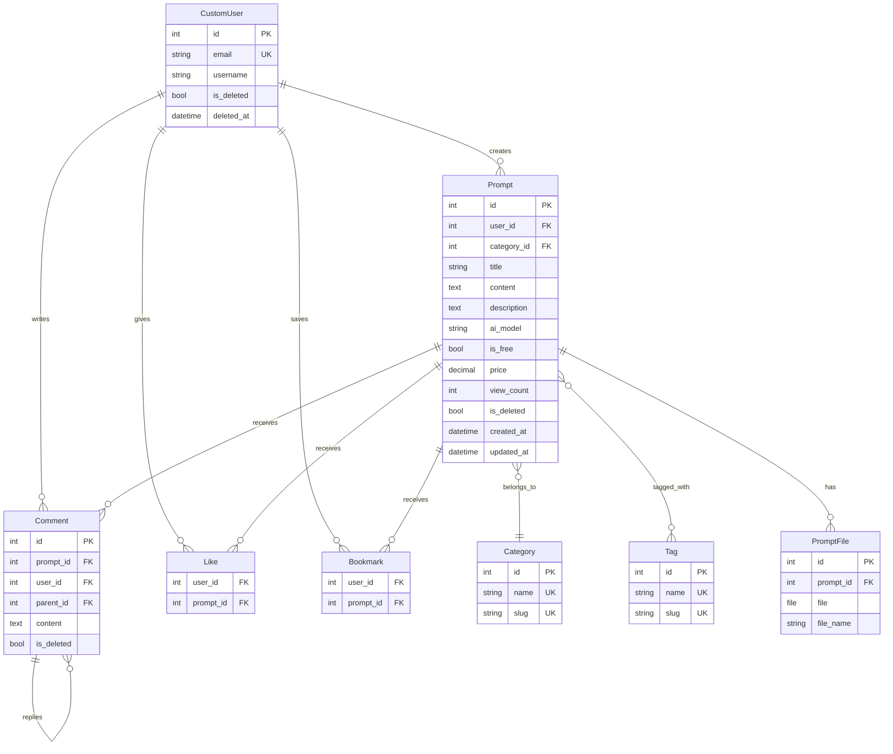
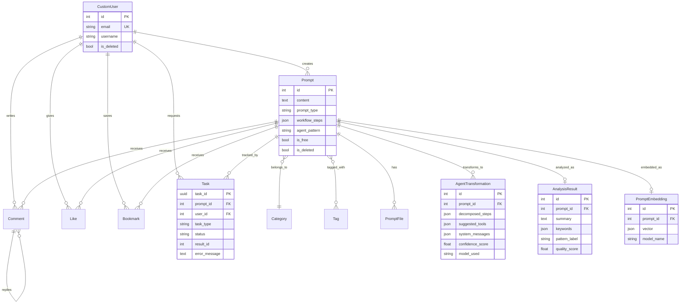
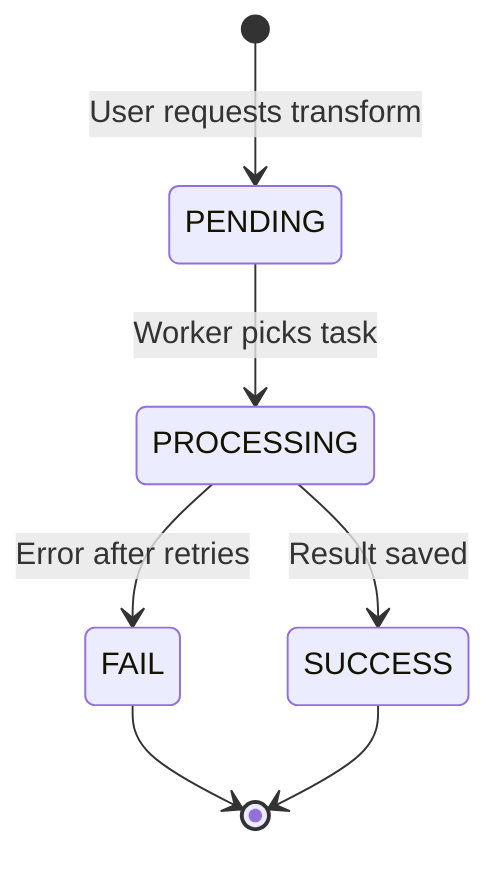

# Data Model by Phase

Consolidates `erd.md` with **actual Phase 3 code** and **Phase 4 target**.  
Render the Mermaid block in GitHub, VS Code (Mermaid extension), or [mermaid.live](https://mermaid.live).

---

## Phase coverage matrix

| Entity | Phase 3 (code) | Phase 4 (planned) |
|--------|:--------------:|:-----------------:|
| CustomUser | ✅ | ✅ (unchanged) |
| Category, Tag | ✅ | ✅ |
| Prompt | ✅ | ✅ + `prompt_type`, `workflow_steps`, `agent_pattern` |
| PromptFile | ✅ | ✅ |
| Comment, Like, Bookmark | ✅ | ✅ |
| AgentTransformation | ❌ | ✅ `ai_gateway` |
| AnalysisResult | ❌ | ✅ `ai_gateway` |
| PromptEmbedding | ❌ | ✅ `ai_gateway` |
| Task | ❌ | ✅ `tasks` |

---

## Phase 3 — implemented ERD

---

## Phase 4 — full target ERD (3차 + 4차)

---

## Spec vs code — field naming

| erd.md / tech doc | Actual code (Phase 3) | Action for docs / ERD |
|-------------------|----------------------|------------------------|
| `Prompt.body` | `Prompt.content` | **Use `content` in implementation**; treat `body` as synonym in prose only |
| `Category.description` | ✅ exists | — |
| `Tag` without slug in some tables | ✅ `slug` in code | Keep slug in API/filters |
| `AnalysisResult` 0..1 per prompt | Not implemented | Confirm: replace on re-analyze vs history table |
| `AgentTransformation` 1..N | Planned (history) | Multiple rows per prompt allowed |
| `PromptEmbedding` OneToOne | WBS: OneToOne | Re-embed overwrites same row |
| `Task.result_id` | Generic FK | Points to transformation/analysis/embedding PK by `task_type` |

---

## `prompt_type` (Phase 4)

| Value | Meaning |
|-------|---------|
| `single_prompt` | Default; classic shareable prompt |
| `agent_recipe` | User-defined multi-step `workflow_steps` |
| `mcp_package` | Future MCP export bundle (may be stub in MVP) |

## `agent_pattern` (Phase 4)

| Value | Pattern |
|-------|---------|
| `sequential` | Linear pipeline |
| `react` | ReAct |
| `reflection` | Self-critique loop |
| `multi_agent` | Multi-agent |
| _(empty)_ | N/A for single prompts |

---

## Task state machine (Phase 4)

| Status | Meaning |
|--------|---------|
| PENDING | Row created; Celery not started or queued |
| PROCESSING | Worker running; FastAPI call in flight |
| SUCCESS | `AgentTransformation` (or other) saved; `result_id` set |
| FAIL | `error_message` set; user can retry new task |

---

## Data asset layers (from tech doc ch.9)

| Layer | Models | Moat / ops |
|-------|--------|------------|
| User-created | Prompt, PromptFile | Core catalog |
| AI-generated | AgentTransformation, AnalysisResult | Value-add; do not overwrite Prompt body |
| Discovery | PromptEmbedding | Similarity improves with volume |
| Behavior | Like, Bookmark, Comment | Future ranking |
| Operations | Task | Not domain content; traceability |

**Principle:** AI outputs live in separate tables; original `Prompt.content` is never replaced by model output.

---

## Indexes (Phase 4 target)

From `erd.md` — apply when implementing:

- `Prompt`: `(category, -created_at)`, `(user, -created_at)`, `(prompt_type)`
- `Task`: `(user, status)`, `(task_type, status)`, `(-created_at)`
- `AgentTransformation`: `(prompt, -created_at)`
- Future: `pgvector` on embedding — **MVP uses JSON list + numpy cosine** per WBS

---

## App ownership

| App | Phase 3 | Phase 4 |
|-----|---------|---------|
| `accounts` | CustomUser, JWT | — |
| `prompts` | Prompt, Category, Tag, PromptFile | Prompt extensions, embed signal |
| `interaction` | Comment, Like, Bookmark | — |
| `ai_gateway` | Empty stub | Models, DRF views, HF client |
| `tasks` | — | Task model, Celery tasks, optional WebSocket |
| `monitoring` | — | Prometheus custom metrics |
