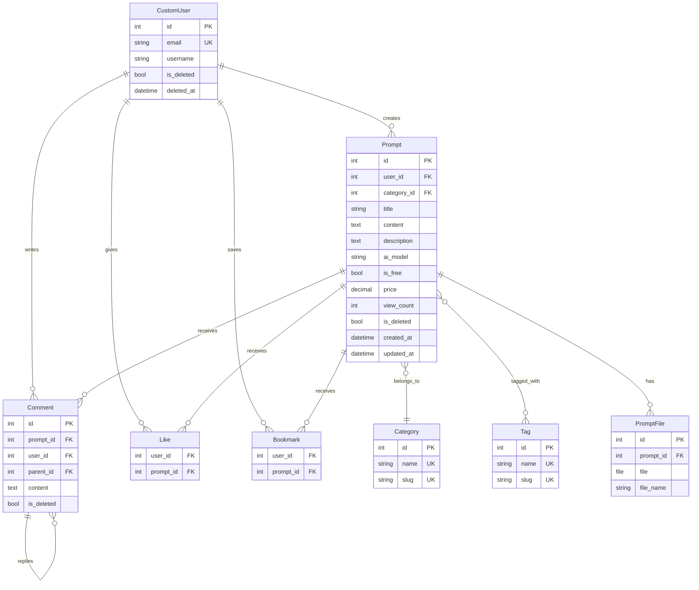
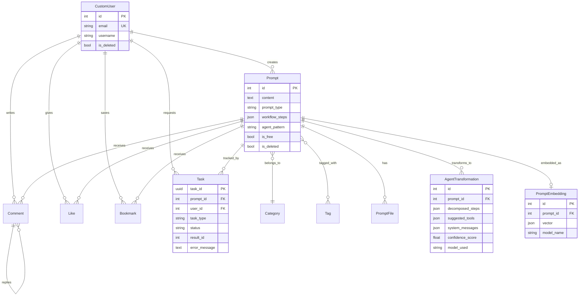
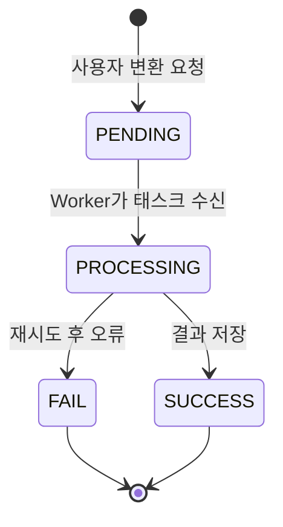

# Phase별 데이터 모델

`erd.md`와 **Phase 3 실제 코드**, **Phase 4 목표**를 통합합니다.  
Mermaid 블록은 GitHub, VS Code (Mermaid 확장), [mermaid.live](https://mermaid.live)에서 렌더링할 수 있습니다.

---

## Phase 커버리지 매트릭스

| Entity | Phase 3 (코드) | Phase 4 |
|--------|:--------------:|:-------:|
| CustomUser | ✅ | ✅ (변경 없음) |
| Category, Tag | ✅ | ✅ |
| Prompt | ✅ | ✅ + `prompt_type`, `workflow_steps`, `agent_pattern` |
| PromptFile | ✅ | ✅ |
| Comment, Like, Bookmark | ✅ | ✅ |
| AgentTransformation | ❌ | ✅ `ai_gateway` |
| AnalysisResult | ❌ | MVP 제외 (Q4) |
| PromptEmbedding | ❌ | ✅ `ai_gateway` |
| Task | ❌ | ✅ `tasks` |

---

## Phase 3 — 구현 ERD

---

## Phase 4 — 전체 목표 ERD (3차 + 4차)

> MVP에서는 `AnalysisResult` 엔티티·관계를 다이어그램에서 제외했습니다 (DECISIONS Q4).

---

## 명세 vs 코드 — 필드 명명

| erd.md / 기술문서 | Phase 3 실제 코드 | 문서/ERD 조치 |
|-------------------|-------------------|---------------|
| `Prompt.body` | `Prompt.content` | **구현·ERD는 `content` 사용**; `body`는 설명에서만 동의어 |
| `Category.description` | ✅ 존재 | — |
| 일부 표에 slug 없음 | ✅ 코드에 `slug` | API/필터에 slug 유지 |
| `AnalysisResult` 0..1 per prompt | MVP 미구현 | Q4: 제외 |
| `AgentTransformation` 1..N | 구현 (이력) | 프롬프트당 다건 허용 |
| `PromptEmbedding` OneToOne | WBS: OneToOne | 재 embed 시 동일 행 갱신 |
| `Task.result_id` | `task_type`별 PK | GenericForeignKey 없음 (Q6) |

---

## `prompt_type` (Phase 4)

| Value | 의미 |
|-------|------|
| `single_prompt` | 기본; 일반 공유 프롬프트 |
| `agent_recipe` | 사용자 정의 `workflow_steps` JSON |
| `mcp_package` | 향후 MCP export 번들 (MVP는 DB choice만, UI 비활성) |

## `agent_pattern` (Phase 4)

| Value | 패턴 |
|-------|------|
| `sequential` | 선형 파이프라인 |
| `react` | ReAct |
| `reflection` | 자기 비평 루프 |
| `multi_agent` | 멀티 에이전트 |
| _(empty)_ | single 프롬프트에 해당 없음 |

---

## Task 상태 머신 (Phase 4)

| Status | 의미 |
|--------|------|
| PENDING | 행 생성; Celery 미시작 또는 대기열 |
| PROCESSING | Worker 실행 중; FastAPI 호출 진행 |
| SUCCESS | `AgentTransformation` 등 저장; `result_id` 설정 |
| FAIL | `error_message` 설정; 새 Task로 재시도 가능 |

---

## 데이터 자산 계층 (기술문서 ch.9)

| 계층 | Models | 가치 / 운영 |
|------|--------|-------------|
| 사용자 생성 | Prompt, PromptFile | 핵심 카탈로그 |
| AI 생성 | AgentTransformation | 부가 가치; `Prompt.content` 덮어쓰지 않음 |
| 탐색 | PromptEmbedding | 볼륨에 따라 유사도 개선 |
| 행동 | Like, Bookmark, Comment | 향후 랭킹 |
| 운영 | Task | 도메인 콘텐츠 아님; 추적성 |

**원칙:** AI 출력은 별도 테이블; 원본 `Prompt.content`는 모델 출력으로 대체하지 않음.

---

## 인덱스 (Phase 4 목표)

`erd.md` 기준 — 구현 시 적용:

- `Prompt`: `(category, -created_at)`, `(user, -created_at)`, `(prompt_type)`
- `Task`: `(user, status)`, `(task_type, status)`, `(-created_at)`
- `AgentTransformation`: `(prompt, -created_at)`
- 향후: embedding에 `pgvector` — **MVP는 JSON list + numpy cosine** (WBS)

---

## 앱 소유

| App | Phase 3 | Phase 4 |
|-----|---------|---------|
| `accounts` | CustomUser, JWT | — |
| `prompts` | Prompt, Category, Tag, PromptFile | Prompt 확장, embed signal |
| `interaction` | Comment, Like, Bookmark | — |
| `ai_gateway` | 스텁 | Models, DRF views, HF client |
| `tasks` | — | Task model, Celery tasks, WebSocket |
| `monitoring` | — | Prometheus 커스텀 메트릭 |
