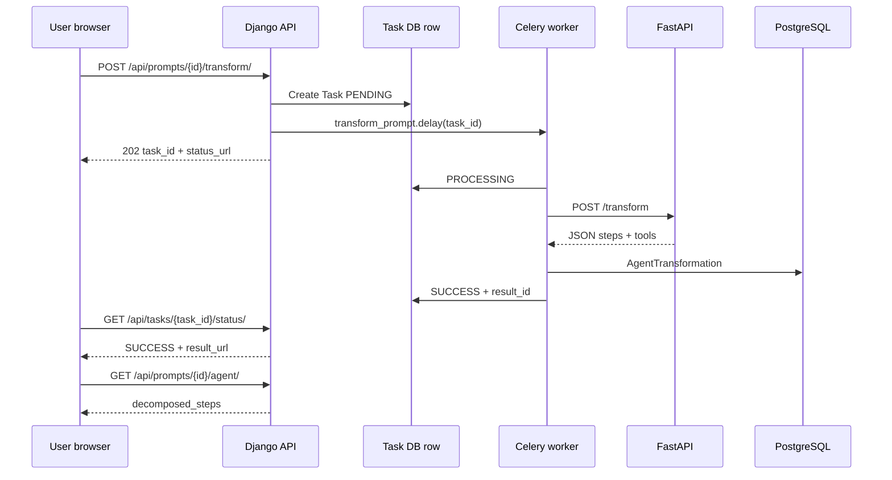

# Phase 4 — 계획·구현 (부트캠프 「4차」)

**상태:** 저장소에 구현됨 (2026-05-27) — 코드 참고; **EC2 Docker Compose**에서 시연  
**출처:** 4차 기술문서, WBS 코드 매핑 (`Promptory_4차_WBS_코드매핑.md`), 목표 ERD (`erd.md`)

**Phase 3 대비 한 줄:** 동일 공유 플랫폼 **+** 프롬프트 → 4단계 에이전트 워크플로 자동 변환 (FastAPI·Hugging Face 또는 mock), 비동기 처리 (Celery + Redis), 임베딩 유사도, Prometheus/Grafana 모니터링.

---

## 1. MVP 목표 (기술문서 ch.6)

| 가설 | 검증 방법 |
|------|-----------|
| 사용자는 원문만보다 자동 생성 에이전트 구조를 더 가치 있게 느낀다 | 변환 결과 좋아요/싫어요 (목표 긍정 ≥60%) |
| 한국어 OSS LLM이 유용한 분해를 만든다 | EXAONE 2.4B (또는 mock) E2E 시연 |
| 비동기 스택이 HTTP 타임아웃 없이 부하를 견딘다 | Task PENDING→SUCCESS p95 &lt; 60s; FAIL 비율 &lt; 5% |

**MVP 명시 제외:** LangGraph 등 다단계 에이전트 실행, PG 결제, 소셜 로그인, i18n.

---

## 2. 기능 매트릭스 (3차 유지 + 4차 추가)

| 기능 | Phase | 사용자 가치 |
|------|-------|-------------|
| 인증, CRUD, 검색, interaction, 보관함 | 3 | 유지 |
| 에이전트 자동 변환 | **4** | 프롬프트 → 4단계 워크플로 + 도구 + system messages |
| 에이전트 레시피 등록 모드 | **4** | `prompt_type=agent_recipe`, `workflow_steps` JSON |
| 변환 결과 API + UI | **4** | 태스크 폴링/WS; 분해 결과 표시 |
| 유사 레시피 추천 | **4** | 임베딩 코사인 유사도 |
| 태스크 상태 (4단계) | **4** | PENDING / PROCESSING / SUCCESS / FAIL |
| 모니터링 | **4** | Prometheus + Grafana (+ 선택 커스텀 메트릭) |
| WebSocket 태스크 알림 | **4** (WBS D7) | 폴링 대체·보완 |
| 자동 분석 (요약/태그) | **4** | **MVP 제외** (DECISIONS Q4) |

---

## 3. 목표 아키텍처 (7 컨테이너)

기술문서 ch.10 / WBS Day 1:

| Service | 역할 | Port (일반적) |
|---------|------|----------------|
| `postgres` | Primary DB | 5432 (internal) |
| `redis` | Celery broker + result backend | 6379 |
| `web` | Django + DRF + templates (daphne) | 8000 |
| `ai_server` | FastAPI, HF inference | 8001 (host) → 8000 (container) |
| `celery_worker` | `transform` / `embed` 태스크 | — |
| `prometheus` | 메트릭 수집 | 9090 |
| `grafana` | 대시보드 | 3000 |



---

## 4. WBS → 구현 매핑

**WBS v2** (2026-06-01 ~ 06-08) 정렬. Phase 3에서 이미 완료된 항목은 Phase 3 문서 참고.

### Day 1 — 인프라

| Task | 대상 파일/산출물 | 선행 |
|------|------------------|------|
| Python deps | `requirements.txt` (+ celery, redis, httpx, structlog, channels, django-prometheus) | — |
| Compose 확장 | `docker-compose.yml` → 7서비스 + volumes | — |
| Settings | `config/settings/base.py` — Celery, Redis, `FASTAPI_URL`, `LLM_PROVIDER` | — |
| Env 템플릿 | `.env.example` — REDIS, HF_* | — |
| 앱 스캐폴드 | `tasks/`, `monitoring/`, `ai_server/` | — |
| **종료 조건:** redis + web + prometheus + grafana healthy | ai_server/celery는 Day 3~4까지 unhealthy 가능 | |

### Day 2 — 데이터 모델

| Task | 대상 | 비고 |
|------|------|------|
| `Prompt` 확장 | `prompts/models.py` | `prompt_type`, `workflow_steps`, `agent_pattern` |
| AI 결과 | `ai_gateway/models.py` | `AgentTransformation`, `PromptEmbedding` (`AnalysisResult` MVP 제외) |
| 운영 추적 | `tasks/models.py` | `Task` UUID PK, 상태 머신 |
| Admin | `ai_gateway/admin.py`, `tasks/admin.py` | — |
| Migrations | `makemigrations prompts ai_gateway tasks` | — |
| Seed | `seed_mockup.py` | 3× `agent_recipe` 예시 |

### Day 3 — FastAPI + Hugging Face

| Task | 대상 | 비고 |
|------|------|------|
| AI 서버 | `ai_server/main.py`, `schemas.py`, `mock.py` | `LLM_PROVIDER=mock`로 빠른 시연 |
| 모델 로더 | `ai_server/models/llm.py`, `embedding.py` | EXAONE + ko-sroberta (선택) |
| 엔드포인트 | `/health`, `/transform`, `/embed` | Prometheus instrumentator |
| Dockerfile | `ai_server/Dockerfile` | HF cache volume |

### Day 4 — Celery + Redis

| Task | 대상 | 비고 |
|------|------|------|
| Celery app | `config/celery.py`, `config/__init__.py` | `autodiscover_tasks` |
| HTTP 클라이언트 | `ai_gateway/services/llm_client.py` | httpx → FastAPI |
| Tasks | `tasks/celery_tasks.py` | 상태 전이 + 재시도 |
| 로깅 | settings structlog JSON | 로그에 `task_id` |

### Day 5 — API + UI

| Task | 대상 | 비고 |
|------|------|------|
| APIs | `ai_gateway/views.py`, `serializers.py`, `urls.py` | transform, agent, task status, similar |
| URL | `config/urls.py` | `include('ai_gateway.urls')` |
| UI | `detail.html`, `prompt-detail.js` | 변환 버튼 + 폴링/WS |
| 결과 표시 | 상세 **인라인만** (Q2) | `GET /api/prompts/{id}/agent/` JSON |

### Day 6 — 모니터링 + 유사도

| Task | 대상 | 비고 |
|------|------|------|
| Django metrics | django-prometheus middleware + `/metrics` | |
| 커스텀 메트릭 | `monitoring/metrics.py` | transformation counters 등 |
| Prometheus/Grafana | `prometheus/prometheus.yml`, grafana provisioning | |
| 유사도 | `ai_gateway/services/similarity.py` | JSON 벡터 numpy cosine |
| 자동 embed | `prompts/signals.py` | post_save → `embed` task |

### Day 7 — WebSocket + 안정화

| Task | 대상 | 비고 |
|------|------|------|
| ASGI | `config/asgi.py`, `tasks/consumers.py` | daphne on `web` |
| 문서 | `docs/troubleshooting.md` | WBS 8시나리오 (선택) |
| 부하 테스트 | `docs/load_test.py` (locust) | 선택 |
| 시연 | Mock vs HF 전체 실행 | |

### Day 8 — 시연 / 제출

- 기술문서 ch.14 21단계 라이브 시연
- 증빙: Grafana, Celery 로그, FAIL 사례, `docker compose ps`

---

## 5. API 추가 (Phase 4)

| Method | Path | 목적 |
|--------|------|------|
| POST | `/api/prompts/{id}/transform/` | 변환 enqueue; `task_id` (202) |
| GET | `/api/tasks/{task_id}/status/` | 상태 폴링; SUCCESS 시 `result_url` |
| GET | `/api/prompts/{id}/agent/` | 최신 `AgentTransformation` |
| GET | `/api/prompts/{id}/similar/` | 유사 프롬프트 Top-k |
| GET | `/api/accounts/me/transformations/` | 보관함 「내 변환」 (Q3) |
| POST | _(internal)_ | FastAPI `/transform`, `/embed` |

---

## 6. UI 변경 (Phase 4)

| 화면 | 변경 |
|------|------|
| 프롬프트 상세 | 「에이전트로 변환하기」, 스피너, 4단계 결과 블록 (인라인) |
| 프롬프트 폼 | 유형: single / agent recipe / MCP (MCP UI 비활성, Q8) |
| 보관함 | 5탭 (+ 내 변환) |

---

## 7. 환경 변수 (Phase 4)

기술문서 / WBS (`.env.example` 참고):

```bash
REDIS_URL=redis://redis:6379/0
CELERY_BROKER_URL=...
CELERY_RESULT_BACKEND=...
FASTAPI_URL=http://ai_server:8000
LLM_PROVIDER=mock          # mock | huggingface
HF_MODEL_NAME=LGAI-EXAONE/EXAONE-3.5-2.4B-Instruct
HF_EMBEDDING_MODEL=jhgan/ko-sroberta-multitask
```

---

## 8. 평가 루브릭 매핑 (기술문서 부록 B)

| 기준 | 점수 | Phase 4 산출물 |
|------|------|----------------|
| AI + 서버 분리 | 15 | FastAPI 컨테이너 + HF/mock |
| AI 결과 DB + API | 10 | `AgentTransformation` 등 |
| 비동기 처리 | 15 | Celery + Redis |
| 태스크 상태 관리 | 10 | 4상태 `Task` + status API |
| Docker Compose 분리 | 10 | 7서비스 |
| 운영 / 로깅 / env | 10 | structlog, `.env` 분리 |
| 배포 / 재현성 | 5 | 15분 compose 가이드 |
| E2E 데이터 흐름 | 5 | 시연 스크립트 |
| 모니터링 | 5 | Prometheus + Grafana |

**WBS 기준 저장소에 이미 반영된 가산:** settings 분리 (+2), CI (+2), CD (+3), SoftDelete manager (+1) 등 ≈ **+9 보너스** (상한 +20).

---

## 9. Phase 4 이후 비즈니스 로드맵 (참고만)

기술문서 ch.15 — **부트캠프 Phase 4 범위 아님:**

| Business phase | 초점 |
|----------------|------|
| Phase 2 (post-MVP) | 베타, MCP export |
| Phase 3 | 결제 (PortOne/Toss), 유료 프롬프트 해제 |
| Phase 4 | B2B, SSO, 감사 |
| Phase 5 | i18n, 글로벌 |

이 폴더의 **Bootcamp Phase 4**와 번호를 혼동하지 말 것.

---

## 10. 구현 체크리스트 (추적용)

이슈·보드에 복사:

- [x] Day 1: deps, compose, settings, scaffolds
- [x] Day 2: models, migrations, seed recipes
- [x] Day 3: FastAPI mock + HF paths
- [x] Day 4: Celery tasks + llm_client
- [x] Day 5: DRF views + detail UI + polling/WS
- [x] Day 6: metrics + similarity + embed signal
- [x] Day 7: WebSocket, polling fallback
- [ ] Day 8: EC2 시연 리허설 + 증빙 캡처
- [x] [DECISIONS.md](./DECISIONS.md) Q1~Q12 반영
