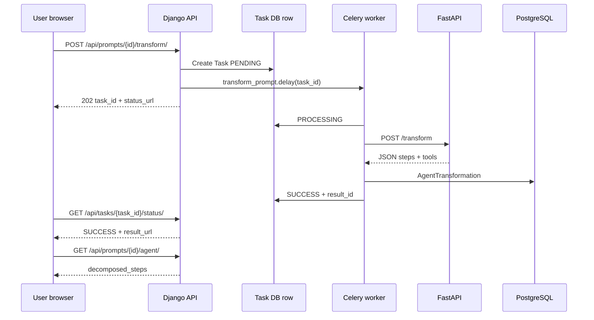

# Phase 4 — Planned (Bootcamp “4차”)

**Status:** Implemented in repository (2026-05-27) — see code; run on **EC2 Docker Compose**  
**Sources:** 4th tech document, WBS code mapping (`Promptory_4차_WBS_코드매핑.md`), target ERD (`erd.md`)

**One-line delta over Phase 3:** Same sharing platform **plus** automatic prompt → 4-step agent workflow (Hugging Face via FastAPI), async processing (Celery + Redis), embeddings-based similarity, and Prometheus/Grafana monitoring.

---

## 1. MVP goals (from tech doc ch.6)

| Hypothesis | How to verify |
|------------|---------------|
| Users value auto-generated agent structure over raw prompt only | Like/dislike on transformation results (target ≥60% positive) |
| Korean OSS LLM can produce useful decompositions | EXAONE 2.4B (or mock) end-to-end demo |
| Async stack handles load without HTTP timeouts | Task PENDING→SUCCESS p95 &lt; 60s; FAIL rate &lt; 5% |

**Explicitly out of MVP:** Running multi-step agents (LangGraph etc.), payment PG, social login, i18n.

---

## 2. Feature matrix (3차 keep + 4차 add)

| Feature | Phase | User value |
|---------|-------|------------|
| Auth, CRUD, search, interaction, library | 3 | Keep |
| Auto agent transformation | **4** | Prompt → 4-step workflow + tools + system messages |
| Agent recipe registration mode | **4** | `prompt_type=agent_recipe`, `workflow_steps` JSON |
| Transform result API + UI | **4** | Poll task; view decomposition |
| Similar recipe recommendation | **4** | Embedding cosine similarity |
| Task status (4 states) | **4** | PENDING / PROCESSING / SUCCESS / FAIL |
| Monitoring | **4** | Prometheus + Grafana (+ optional custom metrics) |
| WebSocket task updates | **4** (WBS D7) | Optional; replaces polling |
| Auto analysis (summary/tags) | **4** | **Out of MVP** (per DECISIONS Q4) |

---

## 3. Target architecture (7 containers)

From tech doc ch.10 / WBS Day 1:

| Service | Role | Port (typical) |
|---------|------|----------------|
| `postgres` | Primary DB | 5432 (internal) |
| `redis` | Celery broker + result backend | 6379 |
| `web` | Django + DRF + templates | 8000 |
| `ai_server` | FastAPI, HF inference | 8001 (host) → 8000 (container) |
| `celery_worker` | `transform` / `analyze` / `embed` tasks | — |
| `prometheus` | Metrics scrape | 9090 |
| `grafana` | Dashboards | 3000 |



---

## 4. WBS → implementation map

Aligned with **WBS v2** (2026-06-01 ~ 06-08). Each row is **planned** unless marked done in Phase 3 doc.

### Day 1 — Infrastructure

| Task | Target files / artifacts | Depends on |
|------|--------------------------|------------|
| Add Python deps | `requirements.txt` (+ celery, redis, httpx, structlog, channels, django-prometheus) | — |
| Expand Compose | `docker-compose.yml` → 7 services + volumes | — |
| Settings | `config/settings/base.py` — Celery, Redis, `FASTAPI_URL`, `LLM_PROVIDER` | — |
| Env template | `.env.example` — REDIS, HF_* | — |
| Scaffold apps | `tasks/`, `monitoring/`, `ai_server/` skeleton | — |
| **Exit:** redis + web + prometheus + grafana healthy | ai_server/celery may be unhealthy until Day 3–4 | |

### Day 2 — Data model

| Task | Target | Notes |
|------|--------|-------|
| Extend `Prompt` | `prompts/models.py` | `prompt_type`, `workflow_steps`, `agent_pattern` |
| AI results | `ai_gateway/models.py` | `AgentTransformation`, `AnalysisResult`, `PromptEmbedding` |
| Ops tracking | `tasks/models.py` | `Task` UUID PK, status machine |
| Admin | `ai_gateway/admin.py`, `tasks/admin.py` | — |
| Migrations | `makemigrations prompts ai_gateway tasks` | — |
| Seed | `seed_mockup.py` | 3× `agent_recipe` examples |

### Day 3 — FastAPI + Hugging Face

| Task | Target | Notes |
|------|--------|-------|
| AI server package | `ai_server/main.py`, `schemas.py`, `mock.py` | `LLM_PROVIDER=mock` for fast demo |
| Model loaders | `ai_server/models/llm.py`, `embedding.py` | EXAONE + ko-sroberta |
| Endpoints | `/health`, `/transform`, `/embed`, `/analyze` | Prometheus instrumentator |
| Dockerfile | `ai_server/Dockerfile` | HF cache volume |

### Day 4 — Celery + Redis

| Task | Target | Notes |
|------|--------|-------|
| Celery app | `config/celery.py`, `config/__init__.py` | `autodiscover_tasks` |
| HTTP client | `ai_gateway/services/llm_client.py` | httpx → FastAPI |
| Tasks | `tasks/tasks.py` | Status transitions + retries |
| Logging | structlog JSON in settings | `task_id` in logs |

### Day 5 — API + UI

| Task | Target | Notes |
|------|--------|-------|
| APIs | `ai_gateway/views.py`, `serializers.py`, `urls.py` | transform, agent, task status, similar |
| URL wiring | `config/urls.py` | `include('ai_gateway.urls')` |
| UI | `detail.html`, `prompt-detail.js` | Transform button + poll (or WS later) |
| **Planned URL (tech doc):** | `/prompts/{id}/agent/` template | WBS embeds result on detail — **see OPEN_QUESTIONS** |

### Day 6 — Monitoring + similarity

| Task | Target | Notes |
|------|--------|-------|
| Django metrics | django-prometheus middleware + `/metrics` | |
| Custom metrics | `monitoring/metrics.py` | transformation counters, inference histogram |
| Prometheus/Grafana | `prometheus/prometheus.yml`, grafana provisioning | |
| Similarity | `ai_gateway/services/similarity.py` | numpy cosine on JSON vectors |
| Auto-embed | `prompts/signals.py` | post_save → `embed` task |

### Day 7 — WebSocket + hardening

| Task | Target | Notes |
|------|--------|-------|
| ASGI | `config/asgi.py`, `tasks/consumers.py` | Optional daphne on `web` |
| Docs | `docs/troubleshooting.md` | 8 scenarios in WBS |
| Load test | `docs/load_test.py` (locust) | Optional |
| Demo | Mock vs HF full run | |

### Day 8 — Demo / submission

- 21-step live demo script (tech doc ch.14)
- Evidence: Grafana, Celery logs, FAIL case, `docker compose ps`

---

## 5. API additions (Phase 4 target)

| Method | Path | Purpose |
|--------|------|---------|
| POST | `/api/prompts/{id}/transform/` | Enqueue transform; return `task_id` (202) |
| GET | `/api/tasks/{task_id}/status/` | Poll status; `result_url` on SUCCESS |
| GET | `/api/prompts/{id}/agent/` | Latest `AgentTransformation` |
| GET | `/api/prompts/{id}/similar/` | Top-k similar prompts |
| POST | _(internal)_ | `/transform`, `/embed`, `/analyze` on FastAPI |

**Library (tech doc):** 5th tab **“My transformations”** → likely `GET /api/accounts/me/transformations/` or filter tasks/transformations — **not defined in WBS; see questions**.

---

## 6. UI changes (Phase 4 target)

| Screen | Change |
|--------|--------|
| Prompt detail | “Convert to agent” button, spinner, 4-step result block |
| Prompt form | Type selector: single / agent recipe / MCP (MCP may be stub) |
| Agent result | **Inline on detail** only; API `GET /api/prompts/{id}/agent/` for JSON |
| Library | 5 tabs (+ my transformations / tasks) |

---

## 7. Environment variables (Phase 4)

From tech doc / WBS (add to `.env.example` when implementing):

```bash
REDIS_URL=redis://redis:6379/0
CELERY_BROKER_URL=...
CELERY_RESULT_BACKEND=...
FASTAPI_URL=http://ai_server:8000
LLM_PROVIDER=mock          # mock | huggingface
HF_MODEL_NAME=LGAI-EXAONE/EXAONE-3.5-2.4B-Instruct
HF_EMBEDDING_MODEL=jhgan/ko-sroberta-multitask
```

---

## 8. Evaluation rubric mapping (tech doc appendix B)

| Criterion | Points | Phase 4 deliverable |
|-----------|--------|---------------------|
| AI + server split | 15 | FastAPI container + HF |
| AI results in DB + API | 10 | `AgentTransformation`, etc. |
| Async processing | 15 | Celery + Redis |
| Task state management | 10 | 4-state `Task` + status API |
| Docker Compose separation | 10 | 7 services |
| Ops / logging / env | 10 | structlog, `.env` split |
| Deploy / reproducibility | 5 | 15-min compose guide |
| End-to-end data flow | 5 | Demo script |
| Monitoring | 5 | Prometheus + Grafana |

**Already credited in WBS (in repo today):** settings split (+2), CI (+2), CD (+3), SoftDelete manager (+1), gap analysis doc (+1) ≈ **+9 bonus points** toward cap +20.

---

## 9. Post–Phase 4 business roadmap (reference only)

From tech doc ch.15 — **not bootcamp Phase 4 scope:**

| Business phase | Focus |
|----------------|-------|
| Phase 2 (post-MVP) | Beta, MCP export |
| Phase 3 | Payments (PortOne/Toss), paid prompt unlock |
| Phase 4 | B2B, SSO, audit |
| Phase 5 | i18n, global |

Do not confuse with **Bootcamp Phase 4** in this folder.

---

## 10. Implementation checklist (copy for tracking)

Use in issues or project board:

- [ ] Day 1: deps, compose, settings, scaffolds
- [ ] Day 2: models, migrations, seed recipes
- [ ] Day 3: FastAPI mock + HF paths
- [ ] Day 4: Celery tasks + llm_client
- [ ] Day 5: DRF views + detail UI + polling
- [ ] Day 6: metrics + similarity + embed signal
- [ ] Day 7: WebSocket (optional), troubleshooting doc
- [ ] Day 8: demo rehearsal + evidence captures
- [ ] Resolve all items in [OPEN_QUESTIONS.md](./OPEN_QUESTIONS.md)
