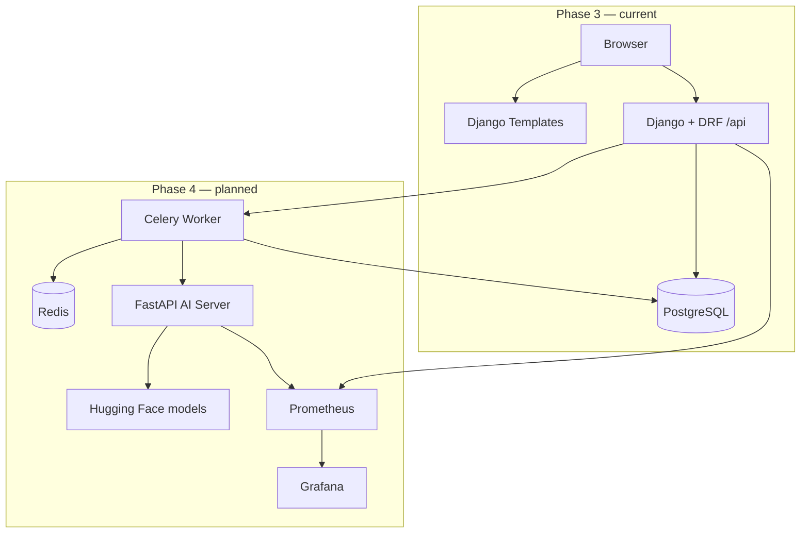

# Promptory — Phase Documentation (Index)

English documentation aligned with:

- `Promptory_4차_기술문서.md` (product & architecture spec)
- `Promptory_4차_WBS_코드매핑.md` (implementation WBS with file/line mapping)
- `erd.md` (target data model for Phase 4)

**Repository audit date:** 2026-05-27  
**Code reality:** Bootcamp **Phase 3 is implemented**; **Phase 4 is not started** (see status table below).

---

## Terminology (avoid confusion)

| Term | Meaning in these docs |
|------|------------------------|
| **Bootcamp Phase 3** | Prompt sharing platform: auth, CRUD, search, interaction, library (current codebase) |
| **Bootcamp Phase 4** | AI agent transformation, Celery/Redis, FastAPI + Hugging Face, monitoring (planned) |
| **Business Phase 1–5** | Post-MVP roadmap in the tech doc (monetization, B2B, global) — **not** the same numbering as bootcamp phases |

---

## Phase status at a glance

| Phase | Scope (summary) | Code status | Doc |
|-------|-----------------|-------------|-----|
| 1–2 | Bootcamp foundation (not detailed in 4th spec) | Out of scope for this repo snapshot | — |
| **3** | JWT, Prompt CRUD, interaction, templates + JS API client | **Done** | [PHASE_3_IMPLEMENTED.md](./PHASE_3_IMPLEMENTED.md) |
| **4** | AI transform, async tasks, FastAPI, Prometheus/Grafana | **Not started** | [PHASE_4_PLANNED.md](./PHASE_4_PLANNED.md) |
| Post-MVP | Payments, MCP export, agent execution, B2B | Not started | Tech doc ch.15 |

---

## Document map

| File | Purpose |
|------|---------|
| [PHASE_3_IMPLEMENTED.md](./PHASE_3_IMPLEMENTED.md) | What exists today: features, routes, APIs, deployment as built |
| [PHASE_4_PLANNED.md](./PHASE_4_PLANNED.md) | Target architecture, WBS day mapping, acceptance criteria |
| [DATA_MODEL_BY_PHASE.md](./DATA_MODEL_BY_PHASE.md) | ERD by phase; code vs spec deltas |
| [DECISIONS.md](./DECISIONS.md) | Locked Q1–Q12 answers |
| [OPEN_QUESTIONS.md](./OPEN_QUESTIONS.md) | Pointer to resolved decisions |
| [WBS_SCHEDULE_0602_0608.md](./WBS_SCHEDULE_0602_0608.md) | **Daily plan: Jun 2–8** (verify, demo, evidence) |
| [../USERFLOW.md](../USERFLOW.md) | End-user flows (Phase 3 baseline, English) |

---

## Architecture evolution



---

## Single end-to-end flow (Phase 4 target)

From the tech spec — **not yet runnable** in this repository:

```
User registers prompt → POST /api/prompts/{id}/transform/
  → Task(PENDING) + task_id returned
  → Celery → FastAPI /transform → HF model
  → AgentTransformation saved → Task(SUCCESS)
  → Client polls GET /api/tasks/{task_id}/status/
  → UI shows 4-step agent workflow
```

Phase 3 stops at prompt CRUD + social features without this pipeline.

---

## Related repo artifacts

| Artifact | Phase |
|----------|-------|
| `docs/STAGE3_GAP_ANALYSIS_AND_DELIVERABLES.md` | Phase 3 gap vs bootcamp rubric |
| `docs/USERFLOW.md` | Phase 3 user flows |
| `.github/workflows/ci.yml` | Phase 3 CI (Postgres + tests) |
| `.github/workflows/cd.yml` | EC2 Docker deploy (Phase 3 ops) |
| `ai_gateway/` (empty stub) | Reserved for Phase 4 |
