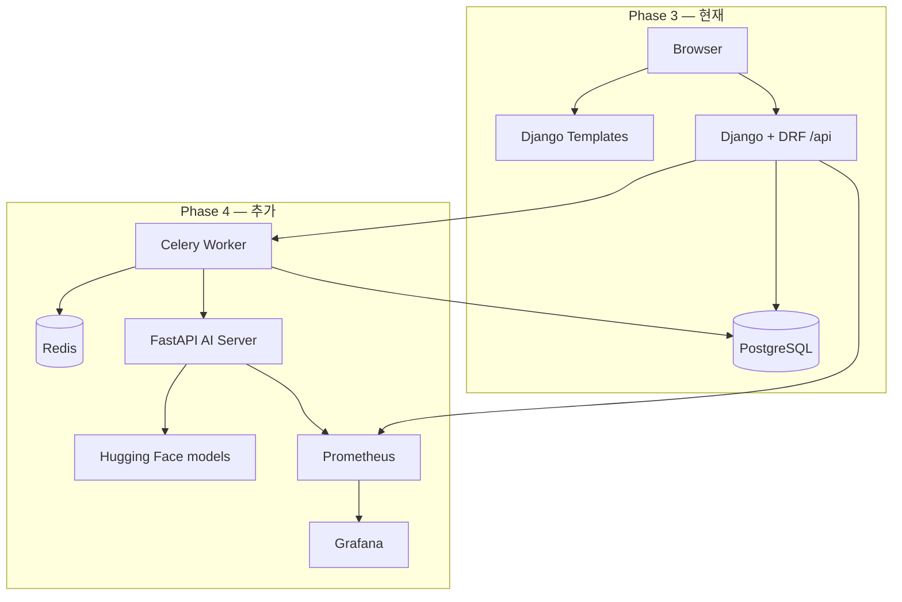

# Promptory — Phase 문서 (목차)

다음 자료와 정렬된 문서입니다:

- `Promptory_4차_기술문서.md` (제품·아키텍처 명세)
- `Promptory_4차_WBS_코드매핑.md` (파일/라인 매핑 WBS)
- `erd.md` (Phase 4 목표 데이터 모델)

**저장소 점검일:** 2026-05-27  
**코드 현황:** 부트캠프 **Phase 3 구현 완료**; **Phase 4 코드 반영됨** (EC2에서 검증·시연 주간 진행 중 — 아래 상태 표 참고).

---

## 용어 (혼동 방지)

| 용어 | 이 문서에서의 의미 |
|------|-------------------|
| **Bootcamp Phase 3** | 프롬프트 공유 플랫폼: 인증, CRUD, 검색, 상호작용, 보관함 (현재 코드베이스) |
| **Bootcamp Phase 4** | AI 에이전트 변환, Celery/Redis, FastAPI + Hugging Face, 모니터링 (저장소에 구현됨, EC2 시연 검증 중) |
| **Business Phase 1–5** | 기술문서 ch.15의 MVP 이후 로드맵 (수익화, B2B, 글로벌) — **부트캠프 phase 번호와 다름** |

---

## Phase 상태 한눈에

| Phase | 범위 (요약) | 코드 상태 | 문서 |
|-------|-------------|-----------|------|
| 1–2 | 부트캠프 기반 (4차 명세에서 상세 없음) | 이 스냅샷 범위 밖 | — |
| **3** | JWT, Prompt CRUD, interaction, 템플릿 + JS API 클라이언트 | **완료** | [PHASE_3_IMPLEMENTED.md](./PHASE_3_IMPLEMENTED.md) |
| **4** | AI transform, 비동기 태스크, FastAPI, Prometheus/Grafana | **구현됨** (EC2 검증·증빙 진행) | [PHASE_4_PLANNED.md](./PHASE_4_PLANNED.md) |
| Post-MVP | 결제, MCP export, 에이전트 실행, B2B | 미착수 | 기술문서 ch.15 |

---

## 문서 맵

| 파일 | 용도 |
|------|------|
| [PHASE_3_IMPLEMENTED.md](./PHASE_3_IMPLEMENTED.md) | 현재 구현: 기능, 라우트, API, 배포 |
| [PHASE_4_PLANNED.md](./PHASE_4_PLANNED.md) | 목표 아키텍처, WBS 일별 매핑, 인수 기준 |
| [DATA_MODEL_BY_PHASE.md](./DATA_MODEL_BY_PHASE.md) | Phase별 ERD; 명세 vs 코드 차이 |
| [DECISIONS.md](./DECISIONS.md) | 확정 Q1~Q12 |
| [OPEN_QUESTIONS.md](./OPEN_QUESTIONS.md) | 해결된 결정으로의 안내 |
| [WBS_SCHEDULE_0602_0608.md](./WBS_SCHEDULE_0602_0608.md) | **6/2~6/8 일별 계획** (검증, 시연, 증빙) |
| [../DEMO_EC2.md](../DEMO_EC2.md) | EC2 배포 URL 및 짧은 시연 스크립트 |

---

## 아키텍처 진화



---

## 단일 E2E 흐름 (Phase 4 목표)

기술 명세 기준 — **EC2 Compose에서 시연**:

```
사용자 프롬프트 등록 → POST /api/prompts/{id}/transform/
  → Task(PENDING) + task_id 반환
  → Celery → FastAPI /transform → HF 또는 mock
  → AgentTransformation 저장 → Task(SUCCESS)
  → 클라이언트 폴링 GET /api/tasks/{task_id}/status/ (또는 WebSocket)
  → UI에 4단계 에이전트 워크플로 표시
```

Phase 3은 이 파이프라인 없이 CRUD + 소셜 기능까지 제공합니다.

---

## 관련 저장소 산출물

| 산출물 | Phase |
|--------|-------|
| `.github/workflows/ci.yml` | Phase 3 CI (Postgres + tests) |
| `.github/workflows/cd.yml` | EC2 Docker 배포 (운영) |
| `ai_gateway/` | Phase 4 모델·API |
| `tasks/`, `ai_server/` | Phase 4 비동기·AI 서버 |
